# Cloud-IDE-Web-Application

<!-- 
    Custom badge form
    아이콘 확인 사이트: https://simpleicons.org/
    
 -->
    
    

스프링을 이용한 클라우드 통합 개발 환경 웹 애플리케이션

## Project Description
- 프레임워크 프로그래밍 개인 프로젝트입니다.
- 스프링 프레임워크를 이용했고 DI, AOP, Transaction 설정을 했습니다.
- 외부에서 별도로 개발 환경을 구축하지 않고 코드를 작성, 저장, 실행까지 할 수 있는 웹 프로젝트입니다.

## Project Architecture
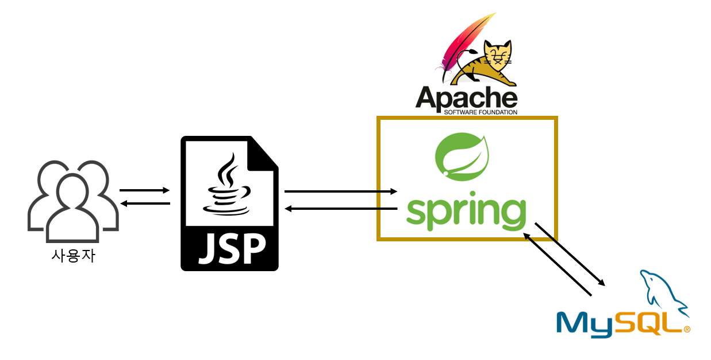
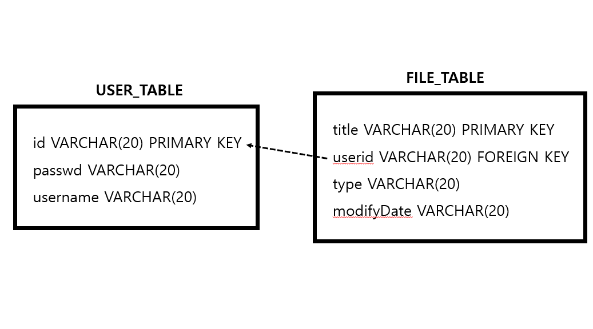

## Screenshot
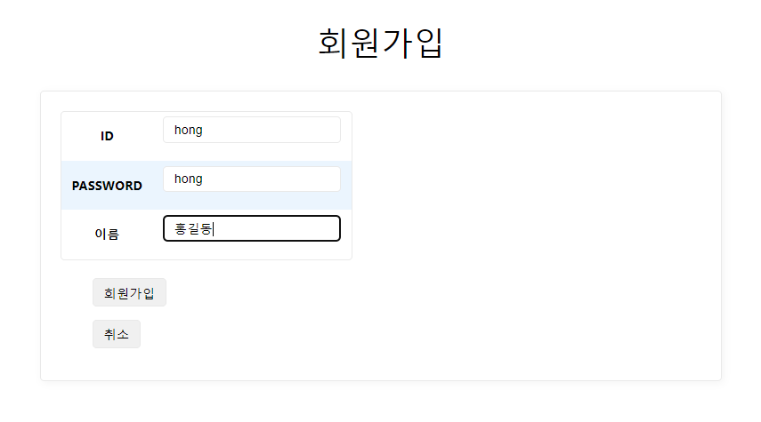
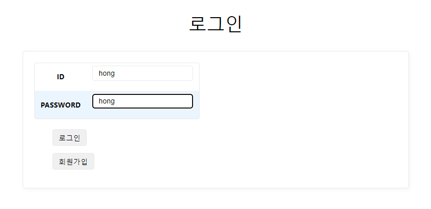
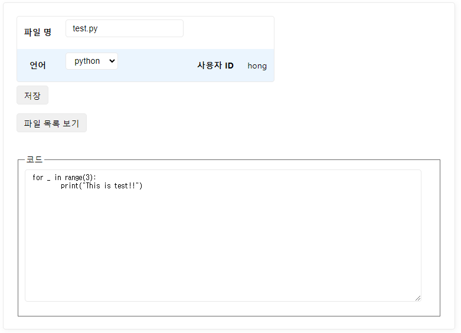
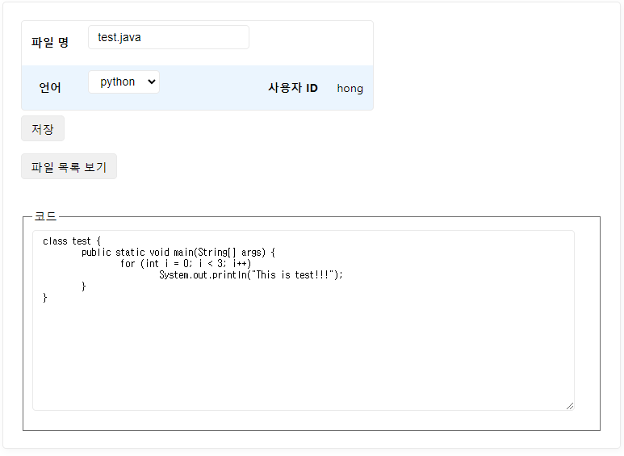
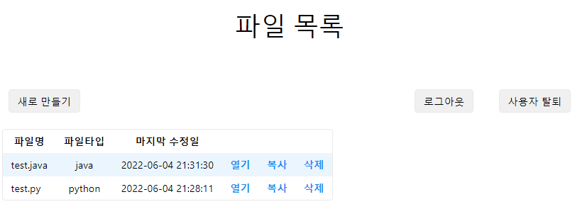
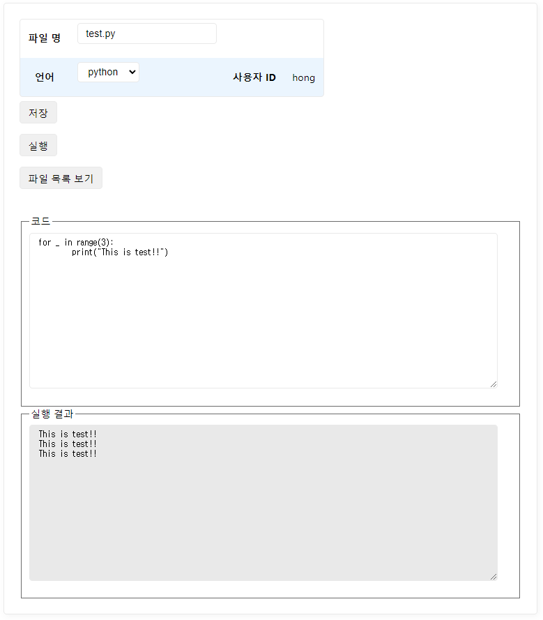
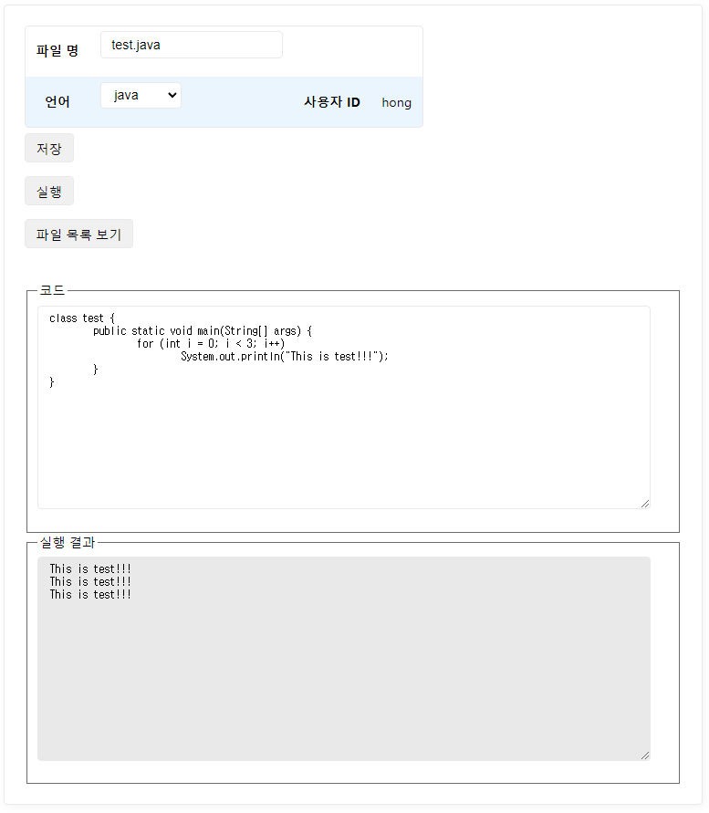
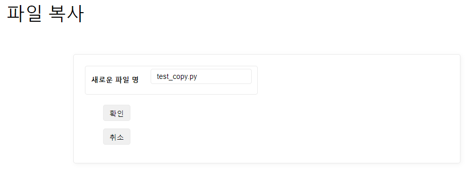
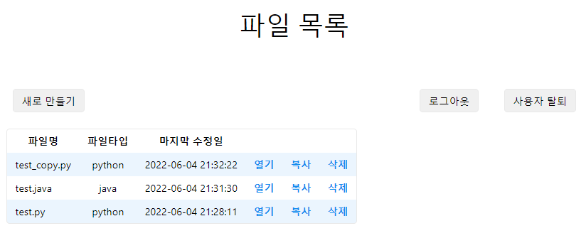
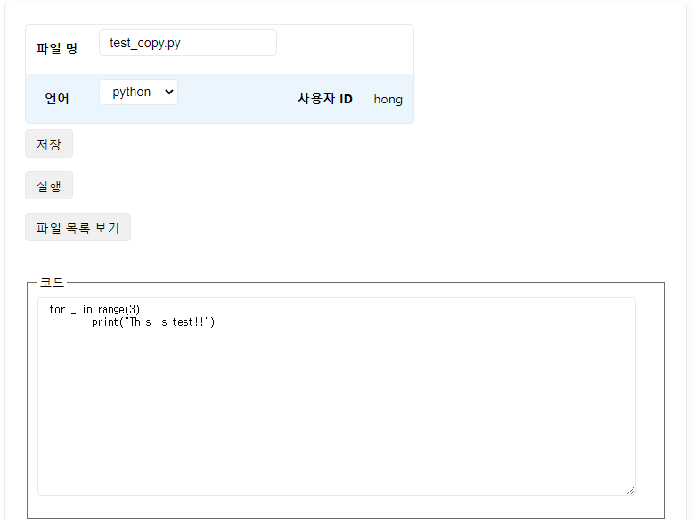

## Working Process
1. Spring 서버를 실행하면 인터넷에서 URL을 통해 view에 접근할 수 있습니다.
2. jsp를 사용해서 view를 구현했습니다.
3. 파일 생성을 하면 파일 정보는 서버에서 DB에 저장하고 파일 내용은 서버를 실행한 PC에 C드라이브에 저장합니다.
4. 파일 실행을 하면 C드라이브에 저장된 파일을 서버에서 실행해 결과를 view에 반환합니다.
5. 사용 가능한 언어는 Python과 Java입니다.

## Run server
- 배포는 Tomcat 9.0에서 시행했습니다.
